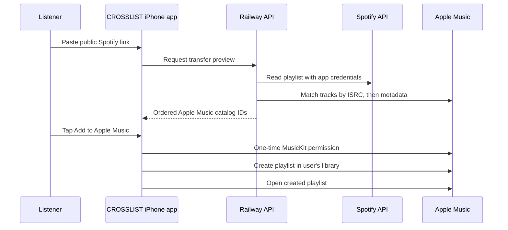

# CROSSLIST


CROSSLIST turns a public Spotify playlist into a playlist in Apple Music without asking the listener to type an Apple ID or password. The iPhone app asks for Apple's standard Music permission once, creates playlists locally through MusicKit, and opens the result in Apple Music.

This repository contains the first production-shaped MVP: **Spotify → Apple Music**.

The API is deployed at [crosslist-production-70f3.up.railway.app](https://crosslist-production-70f3.up.railway.app). Its health endpoint is public; live conversion remains credential-gated.

## Experience

1. Paste a public Spotify playlist link.
2. Preview automatic Apple Music matches.
3. Tap **Add to Apple Music**.
4. Approve the system Music permission on first use only.
5. CROSSLIST creates the playlist and opens it in Apple Music.

The Railway API never receives an Apple Music user token. It reads source metadata and returns catalog IDs; the iPhone performs the library write.

## Repository

- `ios/CROSSLIST.xcodeproj` — native SwiftUI iPhone app, iOS 17+
- `ios/CROSSLISTCore` — platform-neutral URL and API models with Swift tests
- `backend` — FastAPI service for Spotify ingestion and Apple Music matching
- `railway.json` — Railway Docker deployment configuration

## Architecture



## Run the backend

Python 3.12 is recommended.

```bash
cd backend
python3 -m venv .venv
. .venv/bin/activate
pip install -r requirements-dev.txt
cp .env.example .env
PYTHONPATH=. uvicorn app.main:app --reload
```

The API will be available at `http://127.0.0.1:8000`, with interactive documentation at `/docs`.

Run tests with:

```bash
cd backend
PYTHONPATH=. pytest -q
```

## Configure platform credentials

### Spotify

Create a Spotify developer app and provide:

```text
SPOTIFY_CLIENT_ID
SPOTIFY_CLIENT_SECRET
```

Spotify's February 2026 Development Mode currently limits playlist contents to playlists owned by or collaborative with the authenticated user. A consumer launch that reads arbitrary public Spotify playlists requires appropriate Spotify production/extended access or an approved metadata partner. CROSSLIST returns a clear API error when this restriction is encountered; it does not scrape Spotify pages.

### Apple Music catalog

Create a Media ID and MusicKit private key in the Apple Developer portal, then generate a developer token and provide:

```text
APPLE_MUSIC_DEVELOPER_TOKEN
```

The token is used only for public catalog matching. The app's MusicKit entitlement performs user authorization and playlist creation on-device.

### Railway

Set the secrets in the deployed service:

```bash
railway variables set SPOTIFY_CLIENT_ID=…
railway variables set SPOTIFY_CLIENT_SECRET=…
railway variables set APPLE_MUSIC_DEVELOPER_TOKEN=…
```

Then redeploy with `railway up --detach`.

## Run the iPhone app

1. Install full Xcode.
2. Open `ios/CROSSLIST.xcodeproj`.
3. Select your Apple Developer team and, if necessary, change `com.crosslist.app` to a bundle identifier owned by your team.
4. Enable the MusicKit capability for that App ID in the Apple Developer portal.
5. Confirm `CROSSLIST_API_BASE_URL` in `ios/CROSSLIST/Info.plist` points to the Railway deployment.
6. Run on a physical iPhone signed into an active Apple Music subscription.

The app also accepts links shaped like:

```text
crosslist://transfer?url=https%3A%2F%2Fopen.spotify.com%2Fplaylist%2F…
```

## Matching

CROSSLIST preserves playlist order and duplicates. It matches by ISRC first, in batches of 25, then falls back to a weighted comparison of title, artist, album, and duration. Low-confidence results are skipped and shown in the preview instead of silently adding the wrong recording.

## Privacy and security

- Apple Music library permission is requested through the native system dialog.
- Apple Music user tokens and library data stay on the device.
- Spotify and Apple developer credentials stay in Railway environment variables.
- No audio is downloaded or proxied.
- No Spotify pages are scraped.

## Next milestones

- Add a native share extension for sending Spotify links directly to CROSSLIST.
- Add Apple Music → Spotify with one-time Spotify OAuth permission.
- Add a manual review screen for uncertain matches.
- Replace long-lived Apple developer tokens with server-side ES256 token generation and rotation.
